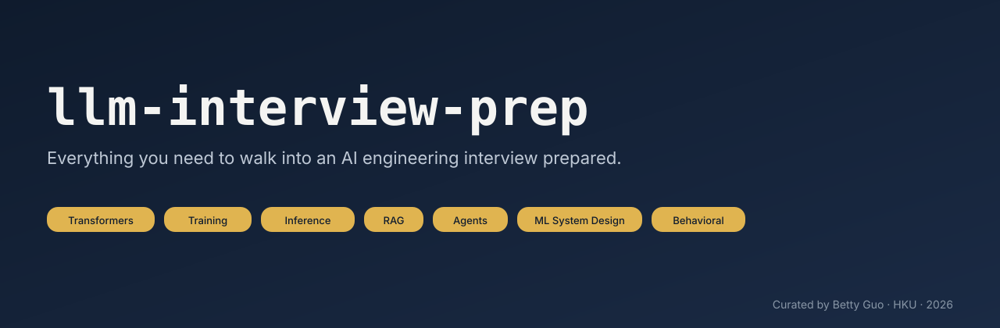

  

# llm-interview-prep

> **Everything you need to walk into an AI, LLM, or ML engineering interview prepared** — concepts, questions, worked answers, system-design drills, and a time-boxed study plan, curated by an active AI researcher.

Hiring loops for AI/ML/LLM roles in 2026 test a wider stack than any one blog post or repo covers — classical ML, deep-learning fundamentals, transformer internals, training and fine-tuning, inference and serving, retrieval and RAG, agents and harnesses, evaluation, ML system design, coding, behavioral. This repo unifies all of it.

Every non-trivial answer carries an **authoritative reference** to the original paper, primary docs, or a widely-cited textbook. The validator refuses to ship entries without one. That's the contract: an answer in this repo is one you can defend in an interview.

---

## Start here — pick a plan

| You are… | Plan |
|----------|------|
| Prepping cold, 8 weeks out | **[Default 8-week plan](study-plan/default-8-week.md)** |
| Experienced engineer, 4 weeks out | **[4-week plan](study-plan/experienced-4-week.md)** |
| **Interview next week** | **[1-week cram](study-plan/cram-1-week.md)** |
| Want a daily template + weekly review checklist | [Daily template](study-plan/daily-template.md) |

If you don't know which plan fits you, start with the 8-week and skip what you already know — every topic has a self-assessment quiz at the top.

---

## Try the live mock-interview site

> **▶ https://bettyguo.github.io/llm-interview-prep/** — full question bank, five study modes, runs in your browser, no signup.

Reading answers is passive prep. The interview itself is active recall under time pressure — so this repo ships a companion site that drills you the same way the loop will.

| Mode | What it does | When to use it |
|------|--------------|----------------|
| **🔎 Browse** | Search, filter, and read all 285+ Qs with full answer / follow-ups / common mistakes / references. | First pass through a new topic. |
| **🧠 Flashcards** | Spaced repetition (1d → 3d → 7d → 14d → 30d, Leitner-style). Rate yourself; cards you miss come back sooner. | Daily 15–30 min review across the cram weeks. |
| **✅ MCQ Quiz** | Auto-generated 4-option questions where the **three distractors are the documented Common mistakes** for that question — the exact half-truths interviewers listen for. | Quick gap-finding: "do I actually know this or just recognize it?" |
| **⏱ Mock Interview** | Timed sequence with notes textarea, model-answer reveal, self-rating 1–5, per-topic scorecard at the end. | Final week: pressure-test under realistic conditions. |
| **🔤 Cloze** | Key terms blanked in the short answer. Click to reveal. | Cementing acronyms, formulas, named results. |

Everything is **static** (no backend), **local-only** (progress in `localStorage`, no account, no analytics), and **auto-deployed** from `main` — when contributors add a question to `prep/`, the live site picks it up on the next push.

→ **[Open the live site](https://bettyguo.github.io/llm-interview-prep/)** · run it offline with `python tools/build_site.py && open site/index.html` · setup details in [`site/README.md`](site/README.md).

---

## The topic spine

<!-- BUILD:TOPICS:START -->

- [01 — ML & DL Fundamentals](prep/01-ml-dl-fundamentals/)
- [02 — Transformers & LLM Internals](prep/02-transformers-llm-internals/)
- [03 — Training & Fine-Tuning](prep/03-training-fine-tuning/)
- [04 — Inference & Serving](prep/04-inference-serving/)
- [05 — Retrieval & RAG](prep/05-retrieval-rag/)
- [06 — Agents & Harnesses](prep/06-agents-harnesses/)
- [07 — Evaluation & Calibration](prep/07-evaluation-calibration/)
- [08 — ML System Design](prep/08-ml-system-design/)
- [09 — ML / AI Coding Questions](prep/09-coding/)
- [10 — Research Discussion & Paper Deep-Dives](prep/10-research-discussion/)
- [11 — Behavioral & Communication](prep/11-behavioral/)
- [12 — Study Plan](prep/12-study-plan/)

<!-- BUILD:TOPICS:END -->

### Stats

<!-- BUILD:STATS:START -->

**Total questions:** 501

| # | Topic | Questions |
|---|-------|-----------|
| 1 | 01 — ML & DL Fundamentals | 62 |
| 2 | 02 — Transformers & LLM Internals | 63 |
| 3 | 03 — Training & Fine-Tuning | 61 |
| 4 | 04 — Inference & Serving | 63 |
| 5 | 05 — Retrieval & RAG | 55 |
| 6 | 06 — Agents & Harnesses | 49 |
| 7 | 07 — Evaluation & Calibration | 48 |
| 8 | 08 — ML System Design | 10 |
| 9 | 09 — ML / AI Coding Questions | 42 |
| 10 | 10 — Research Discussion & Paper Deep-Dives | 23 |
| 11 | 11 — Behavioral & Communication | 25 |
| 12 | 12 — Study Plan | 0 |

<!-- BUILD:STATS:END -->

---

## What's in scope (and what isn't)

**In scope.** Everything an interview loop for an AI/ML/LLM engineering role actually tests: classical ML fundamentals, deep-learning fundamentals, transformer & LLM internals, training & fine-tuning (SFT, RLHF, DPO, GRPO, LoRA/QLoRA), inference & serving (KV cache, paged attention, speculative decoding, quantization), retrieval & RAG, agents & harnesses, evaluation & calibration, ML system design drills (10 worked), ML/AI coding (NumPy/PyTorch implementations), research discussion, behavioral.

**Out of scope.** A general ML/DL course (see the peer repo [`ai-engineer-roadmap`](#peer-resources)). General SWE/algorithms LeetCode prep (see `coding-interview-university`). General system design beyond ML (see `system-design-primer`). Vendor-specific certification prep. Career coaching narratives.

This is interview prep. The line is intentional.

---

## How this is kept correct

Every non-trivial answer must cite an authoritative source — the original paper, primary framework docs (PyTorch / HuggingFace / OpenAI / Anthropic), or a widely-cited textbook (Murphy, Goodfellow, Speech & Language Processing). The `tools/validate_entries.py` step in CI refuses to merge entries that lack a `References` block.

Contested or version-dependent facts (e.g. "FlashAttention is X× faster") are stated as tradeoffs, not absolutes. Where the field has revised a popular result (Kaplan → Chinchilla scaling), the revised view is the primary one, with the older one shown for context.

**See a wrong answer?** Open a [wrong-answer issue](.github/ISSUE_TEMPLATE/wrong-answer.md) — wrong answers are the highest-priority bug in this repo.

---

## Peer resources

This repo sits beside three peer repos. Each owns a distinct noun; none is parent or child.

- [`ai-engineer-roadmap`](https://github.com/bettyguo/ai-engineer-roadmap) — the **breadth** of the AI engineering career path. If you don't know what to study yet, start there, then come back here for the interview gate.
- [`harness-engineer-roadmap`](https://github.com/bettyguo/harness-engineer-roadmap) — agent & harness engineering, in depth. If your loop will probe agentic systems specifically, that repo's depth complements this one's breadth.
- [`build-your-own-ai`](https://github.com/bettyguo/build-your-own-ai) — hands-on, from-scratch implementations. The single most reliable way to internalize the concepts on this list is to build the things.

---

## Curator

**Betty Guo** ([Dongxin Guo](https://bettyguo.github.io)), PhD candidate in Computer Science at [The University of Hong Kong](https://www.cs.hku.hk/), advised by [Prof. Siu-Ming Yiu](https://www.cs.hku.hk/people/academic-staff/smyiu).

- ORCID: [0009-0000-2388-1072](https://orcid.org/0009-0000-2388-1072)
- Research focus: trustworthy AI, reliable AI systems, LLM agents, retrieval-augmented systems, LLM theory.

This repo grew out of preparing for my own industry interviews while finishing a PhD, and noticing that nothing on GitHub unified the full 2026 AI-interview stack in one place. It's released under CC-BY-4.0 so anyone can adapt it for cohorts, study groups, or bootcamps; please attribute.

---

## Contributing

PRs welcome. The contract: every new concept/derivation/system-design answer carries at least one authoritative reference. The validator enforces this. See [CONTRIBUTING.md](CONTRIBUTING.md) and the [PR template](.github/PULL_REQUEST_TEMPLATE.md).

Common contributions:
- **A question you were asked in a recent interview loop.** These are the highest-signal additions.
- **A correction with a citation.** See the [wrong-answer template](.github/ISSUE_TEMPLATE/wrong-answer.md).
- **A new system-design drill** following the canonical 6-step structure in [`prep/08-ml-system-design/README.md`](prep/08-ml-system-design/).

---

## Maintenance

Quarterly content review; weekly automated link check; CHANGELOG updated per release. The 2026 LLM landscape drifts fast — staleness is a known risk; visible maintenance is the mitigation.

## Star history

## License

Content: [CC-BY-4.0](LICENSE) · Tooling: [MIT](LICENSE).

---

Curated by <a href="https://github.com/bettyguo">Betty Guo</a> · University of Hong Kong · 2026.

